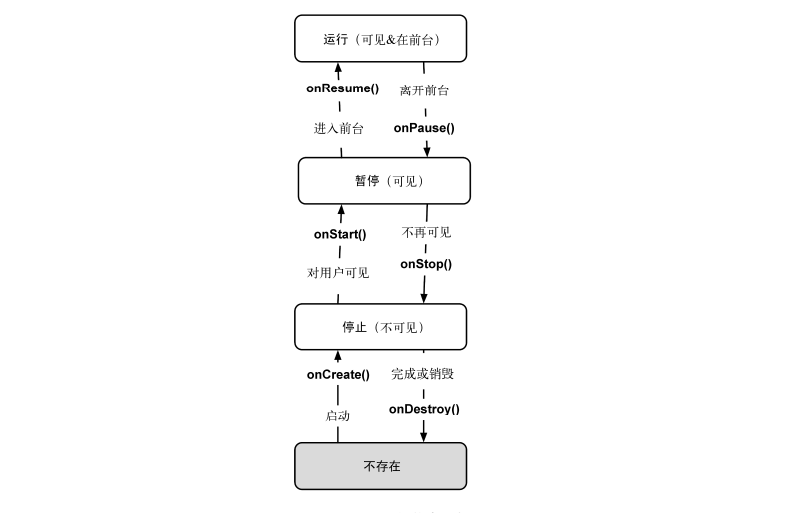

### Activity中finish()和onDestory()的区别：
* finish()方法用于结束一个Activity的生命周期，将处于栈顶的活动移除栈。
* 而onDestory()方法是Activity的一个生命周期方法。释放活动实例在内存中占据的空间。
finish()方法会调用都onDestory()方法

### UI线程更新

### Activity生命周期：
1. 返回栈：Android使用任务来管理活动，一个任务就是一组存放在栈里的活动的集合，这个栈也被称为返回栈。栈是一种先进后出的数据结构，默认情况下，启动一个新活动时，它会在返回栈中入栈，并处于栈顶的位置，当按下Back键或调用finish()方法去销毁一个活动时，处于栈顶的活动会出栈。
2. 活动状态：
  * 运行状态：活动处于返回栈栈顶时，该活动就处于运行状态。
  * 暂停状态：活动不再处于栈顶，但仍可见时，活动就进入了暂停状态。
  * 停止状态：当一个活动不再处于栈顶位置，并且完全不可见时，就进入了停止状态。
  * 销毁状态：当一个活动从返回栈中移除后就变成了销毁状态。
3. 活动的生存期：
  * onCreate()：活动第一次创建时调用，完成活动的初始化操作。
  * onStart()：在活动由不可见变为可见的时候调用。
  * onResume()：在活动准备好和用户进行交互的时候调用。此活动一定位于返回栈栈顶，并且处于运行状态。
  * onPause()：在系统准备启动或恢复另一个活动时调用。通常会在该方法将一些消耗CPU的资源释放掉，以及保存一些关键数据。
  * onStop()：在活动完全不可见时调用。
  * onDestory()：在活动被销毁前调用，之后的活动变为销毁状态。
  * onRestart()：在活动由停止状态变为运行状态之前调用，即活动重新启动。

  

  Activity中的回调方法的修饰符都是Protected
  ===
