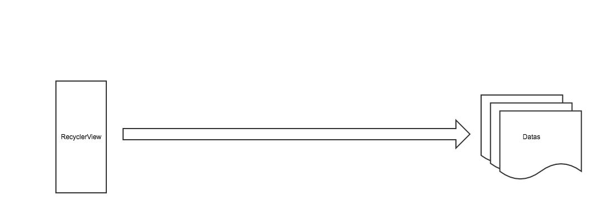

## RecyclerView设计思路：
* RecyclerView官网定义：在限定视图内展示大量数据。

* RecyclerView的职责就是将Datas中的数据以一定的规则展示在上面，但RecyclerView只是一个ViewGroup，它只认识View，不清楚Data数据的具体结构，所以RecyclerView需要一个``Adapter（适配器）``来与Datas交流。
``
RecyclerView只会和ViewHolder接触，而Adapter的工作就是将Data转换为RecyclerView认识的ViewHolder,从而间接达到与Datas交流。``

* RecyclerView又通过LayoutManager来管理布局，Layoutmanager协助RecyclerView来完成布局，将一个一个的View布局在RecyclerView上。

* 但是LayoutManager又不懂如何管理View，LayoutManger在需要View时会向Recycler索取，在不需要View（滑出）时，就直接将废弃的View丢给Recycler

* ItemAnimator：实现子View 变动的时候的动画。

RecyclerView作为一个View，它只负责接收用户的各种信息，然后将各种信息各司其职分发出去
===
