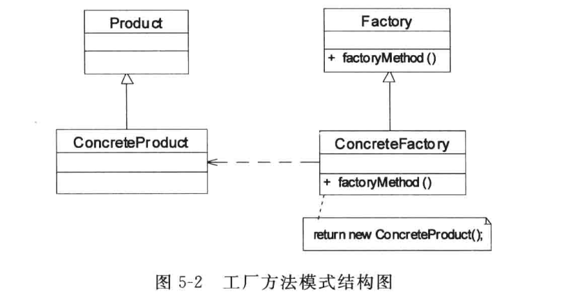

### 工厂方法模式（Factory Method）--多态工厂的实现
+ 定义：定义一个用于创建对象的接口，让子类决定实例化哪一个类，工厂方法使一个类的实例化延迟到其子类。
+ 类图：

  
+ 组成：
  + 工厂接口（Factory）：工厂接口是工厂方法模式的核心，与调用者直接交互产品来提供产品。在实际编程中，有时也会使用一个抽象类来作为与调用者交互的接口，其本质是一样的。
  + 工厂实现（ConcreteFactory）：在编程中，工厂实现决定如何实例化产品，是实现扩展的途径，需要有多少种产品，就需要有多少个具体的工厂实现。
  + 产品接口（Product）：产品接口的主要目的是为了定义产品实现的规范，所有的产品实现都必须遵循产品接口定义的规范。产品接口也可以通过抽象类来代替，但是要注意不要违背里氏替换原则。
  + 产品实现（ConcreteProduct）：实现产品接口的具体类。
+ 代码：

  产品接口及产品实现：
  ```Java
  //产品接口
  public interface IProduct {
      void create();
      void show();
  }
  //产品实现1
  public class Product1 implements IProduct {
       @Override
       public void create() {
           System.out.println("Create Product1");
       }

       @Override
       public void show() {
           System.out.println("Show Product1");
       }
  }
  //产品实现2
  public class Product2 implements IProduct{
      @Override
      public void create() {
          System.out.println("Create Product2");
      }

      @Override
      public void show() {
          System.out.println("Show Product2");
      }
  }
  ```
  工厂接口及工厂实现：
  ```Java
  //工厂接口
  public interface IFactory {
    public IProduct createProduct();
  }
  //工厂实现
  //创建product1对象的工厂实现
  public class FactoryMethod1 implements IFactory {
    @Override
    public IProduct createProduct() {
        return new Product1();
  }
  //创建product2对象的工厂实现
  public class FactoryMethod2 implements IFactory {
      @Override
      public IProduct createProduct() {
          return new Product2();
      }
  }
  ```
  客户类：
  ```Java
  //客户类
  public class Client {
      public static void main(String[] args) {
          //创建product1类型的具体产品
          IFactory iFactory1 = new FactoryMethod1();
          IProduct product1 = iFactory1.createProduct();
          product1.create();
          product1.show();
          //创建product2类型的具体产品
          IFactory iFactory2 = new FactoryMethod2();
          IProduct product2 = iFactory2.createProduct();
          product2.create();
          product2.show();
      }
  }
  ```
  运行结果：
  ```
  Create Product1
  Show Product1
  Create Product2
  Show Product2
  ```
  使用工厂方法之后，调用端的耦合度大大降低，并且对于工厂来说，是可以扩展的。如果想要在生产其他产品，只需要在工厂里面赠加一个工厂类的实现即可。无论灵活性还是稳定性都得到了极大的提高。

#### 方案改进
+ 改用将工厂实现类名作为参数存储在配置文件里面，使用XMLUtil类来读取
```xml
<?xml version="1.0" encoding="UTF-8" ?>
<config>
    <className>FactoryMethod1</className>
</config>
```
```Java
public class XMLUtil {
    //该方法用于从配置文件读取具体类名，并返回一个实例对象
    public static Object getBean(){
        try {
            //创建文档对象
            DocumentBuilderFactory dFactory = DocumentBuilderFactory.newInstance();
            DocumentBuilder builder = dFactory.newDocumentBuilder();
            Document doc;
            doc = builder.parse(new File("configuration/config1.xml"));

            //获取包含类名的文本节点
            NodeList nodeList = doc.getElementsByTagName("className");
            Node classNode = nodeList.item(0).getFirstChild();
            String classname = classNode.getNodeValue().trim();

            //创建该类的实例并返回
            Class c = Class.forName("com.indi.jinlu.FactoryMethod." + classname);//包名+类名
            Object obj = c.newInstance();
            return obj;
        } catch (Exception e) {
            e.printStackTrace();
            return null;
        }
    }
}
```
+ 可以在工厂中定义多个重载的方法，在具体的工厂中实现这些工厂方法，这些方法可以包含不同的业务逻辑，以满足对不同产品的需求。
+ 有时为了简化客户端的使用，可以对客户端隐藏工厂方法。通过将业务方法的调用移入工厂类，可以直接使用工厂对象来调用产品对象的业务逻辑，客户端无需直接使用工厂方法。
```Java
abstract class newFactory {
    //在工厂类里面直接调用产品类的业务方法create()
    public void create(){
        IProduct iProduct = this.createProduct1();
        iProduct.create();
    }
    abstract IProduct createProduct1();
}
```

### 总结
**优点**：

  （1）向外界隐藏了那种产品类被实例化这一细节

  （2）使一个类的实例化延迟到其子类，由子类决定实例化哪一个类

  （3）系统扩展性很好，符合开闭原则

**缺点**：

  （1）编写新的具体产品类时，一定程度上增加了系统的复杂度

  （2）引入抽象层增加了系统的抽象性和理解难度
