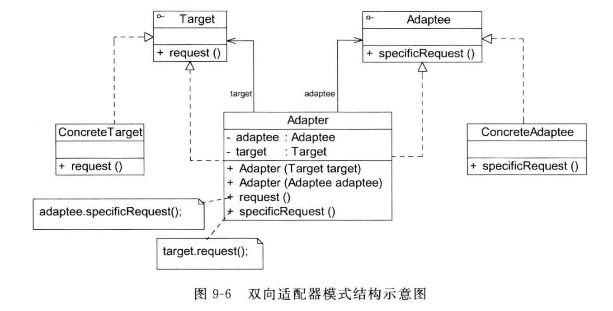

# 适配器模式——不兼容结构的协调
+ 定义：适配器模式（Adapter Pattern）即将一个接口转换成客户需要的另一个接口，使接口不兼容的那些类可以一起工作，其别名也称为包装器。适配器模式既可以作为类结构模型，也可以作为对象结构模型。
+ 组成：
  + 目标抽象类（Target）：目标抽象类定义客户所需接口，可以是一个抽象类或接口，也可以是一个具体类。
  + 适配器类（Adapter）：适配器类可以调用另一个接口，作为一个转换器，将 Adaptee 和 Target 进行适配。适配器类是适配器模式的核心，在对象适配器模式中，他通过继承 Taret 并关联一个 Adaptee 对象使二者产生联系。
  + 适配者类（Adaptee）：适配者即被适配的角色，他定义了一个已经存在的接口，这个接口需要适配，适配者一般是一个具体类，包含了客户希望使用的业务方法，在某些情况下，可能没有适配者的源代码，
+ 对象适配器模式：通过继承 Target 并关联一个 Adaptee 对象使二者产生联系。

  目标接口（抽象成绩操作类）
  ```Java
  public interface ScoreOperation {
    public int[] score(int array[]);    //成绩排序
    public int search(int array[],int key);     //成绩查找
  }
  ```
  适配器类
  ```Java
  public class OperationAdapter implements ScoreOperation {

    private QuickSort sortObj;
    private BinarySearch searchObj;

    public OperationAdapter(){
        sortObj = new QuickSort();
        searchObj = new BinarySearch();
    }

    @Override
    public int[] score(int[] array) {
        return sortObj.quickSort(array);    //调用适配者类的quickSort()方法
    }

    @Override
    public int search(int[] array, int key) {
        return searchObj.binarySearch(array,key);      //调用适配者类的binarySearch()方法
    }
  }
  ```
  具体适配者：
  ```Java
  //快速排序类：适配者
public class QuickSort {
    public int[] quickSort(int array[]){
        sort(array,0,array.length-1);
        return array;
    }

    public void sort(int array[],int p,int r){
        int q = 0;
        if(p < r){
            q = partition(array,p,r);
            sort(array,p,q-1);
            sort(array,q+1,r);
        }
    }

    public int partition(int[] a,int p,int r){
        int x = a[r];
        int j = p - 1;
        for (int i = p; i <= r - 1; i++){
            if(a[i] <= x) {
                j++;
                swap(a, i, j);
            }
        }
        swap(a,j+1,r);
        return j+1;
    }

    public void swap(int[] a,int i,int j){
        int t = a[i];
        a[i] = a[j];
        a[j] = t;
    }
  }

  //二分查找类：适配者
public class BinarySearch {
    public int binarySearch(int array[],int key){
        int low = 0;
        int high = array.length - 1;
        while(low < high){
            int mid = (low + high)/2;
            int midVal = array[mid];
            if(midVal < key){
                low = mid + 1;
            }
            else if(midVal > key){
                high = mid - 1;
            }
            else{
                return 1;
            }
        }
        return -1;
    }
  }
  ```
  客户类
  ```Java
  public class Client {
    public static void main(String[] args) {
        ScoreOperation operation;       //针对抽象目标接口编程
        operation = (ScoreOperation) XMLUtil.getBean();
        int scores[] = {84,91,90,75,60,88,96,50};
        int result[];
        int score;

        System.out.println("成绩排序结果：");
        result = operation.score(scores);
        for (int i = 0; i < scores.length; i++){
            System.out.print(scores[i] + ",");
        }
        System.out.println();

        System.out.println("查找成绩90：");
        score = operation.search(scores,90);
        if (score != -1){
            System.out.println("找到成绩90");
        }else{
            System.out.println("找不到成绩90");
        }

    }
  }
  ```
  测试结果
  ```
  成绩排序结果：
  50,60,75,84,88,90,91,96,
  查找成绩90：
  找到成绩90
  ```
+ 类适配器模式：类适配器模式与对象适配器模式最大的区别就是其适配器与适配者之间的关系是继承关系。即适配器实现Target接口，并继承适配者类。
  + 典型实现：
  ```Java
  class Adapter extends Adaptee implents Target{
    public void request{
      specificRequest();
      /*调用适配者类的specificRequest()方法，实现适配。*/
    }
  }
  ```
  但由于Java、C#等语言不支持多重继承，因此类适配器模式的使用受到很多限制。故在Java等面向对象的编程语言中，大部分情况下使用对象适配器模式，类适配器模式较少使用。
+ 双向适配器模式：在对对象适配器模式的使用过程中，如果在适配器中同时包含对目标类和适配者类的引用，适配者可以通过他调用目标类的方法，目标类也可以通过他调用适配者的方法，那么适配器就是一个双向适配器。

 
  + 典型实现：
  ```Java
  public class Adapter extends Adaptee implements Target{
    //同时维持抽象目标和对适配者类的引用
    private Target target;
    private Adaptee adaptee;

    public Adapter(Target target){
        this.target = target;
    }

    public Adapter(Adaptee adaptee){
        this.adaptee = adaptee;
    }

    @Override
    public void request() {
        adaptee.specificRequest();
    }

    @Override
    public void specificRequest() {
        target.request();
    }
  }
  ```
+ 缺省适配器模式：当不需要实现一个接口所提供的所有方法时，可以先设计一个抽象类实现该接口，并为接口中的每个方法都提供一个默认实现（空方法），那么该抽象类的子类可以选择性的覆盖该父类的某些方法来实现需求，他适用于不想使用一个接口中的所有方法的情况，又称为单接口适配器模式。
  + 组成：
    + 适配者接口（ServiceInterface）：他是一个接口，通常在该接口中声明大量方法
    + 缺省适配器类（AbstractServiceClass）：他是缺省适配器模式的核心，使用空方法的形式实现了在ServiceInterface中声明的方法，他一般设为抽象类，因为对他实例化没有任何意义。
    + 具体业务类（ConcreteServiceClass）：他是缺省适配器类的子类。有了缺省适配器类，他可以根据需要选择性的覆盖在适配器类中实现的方法。

### 总结
+ **优点**：
  + 将目标抽象类与适配者类解耦，通过引入一个适配器来重用现有的适配者类，无需修改原有结构。
  + 增加了类的透明性和复用性，将具体的实现细节封装在适配者类中。
  + 灵活性和扩展性都非常好，通过使用配置文件，可以方便的替换或者添加适配器类，符合开闭原则。
+ **缺点**：
  + 对于Java，C#等不能实现多继承的语言，一次只能适配一个适配者。
  + 适配者类不能为最终类。
  + 类适配器模式中的目标抽象类只能为接口。
