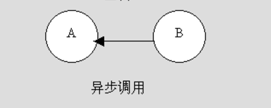
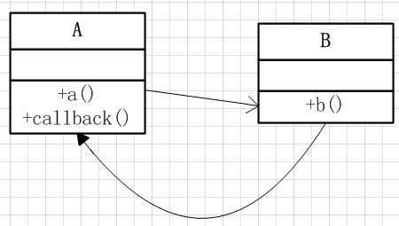

# Java回调机制
### 同步调用和异步调用：
+ 同步调用：是一种阻塞式调用，调用方要等待对象执行完毕才返回，他是一种单向调用
+ 异步调用：A处于主线程，B处于子线程。
  + A，B都在运行，B遇到某种情况，调用A的方法通知A（只有B调用A）
  
  + A运行过程中调用B的方法，B执行完后可能会通知A（异步回调），也可能不通知A（非异步回调）

### 回调
+ 类A的a()方法调用类B的b()方法
+ 类B的b()方法执行完毕主动调用类A的callback()方法

  这种调用方法是一种双向的调用方式
  

### 模拟场景
+ 场景：老师问学生问题，学生思考完毕回答老师。
+ 抽象：
  + 主体一：老师（类A）
  + 主体二：学生（类B）
  + 类A的a()方法：问学生问题
  + 类B的b()方法：思考

### 代码实现：
+ 首先定义一个`回调接口`，只有一个方法tellAnswer(int answer)方法，即学生思考完毕告诉老师答案：
```Java
//回调接口，学生思考完告诉老师答案
public interface Callback {
	public void tellAnswer(int answer);
}
```
+ 定义一个`老师类`，实现CallBack接口：
  + 创建新线程，实现回调（异步回调）（Teacher1）
```Java
public class Teacher implements Callback {
	private Student stu;
	public Teacher(Student stu){
		this.stu = stu;
	}

	public void askQuestion(){
		System.out.println("老师叫学生想问题去。。。。");
		new Thread(new Runnable() {
			@Override
			public void run() {
				stu.think(Teacher.this);
			}
		}).start();
	}

	public void tellAnswer(int answer) {
		System.out.println("知道了，你的答案是：" + answer);
	}

	public void doOtherThing() {
		System.out.println("老师去做其他事了。。。");
	}
}
```
  + 同步回调，在同一个线程中进行回调，可能会造成线程阻塞，必须要等上一步调用完成之后，才能执行下一步操作（Teacher2）
  ```java
public class Teacher implements Callback {

	private Student stu;

	public Teacher(Student stu){
		this.stu = stu;
	}

	public void askQuestion(){
		System.out.println("老师叫学生想问题去。。。。");
		stu.think(Teacher.this);
	}

	public void tellAnswer(int answer) {
		System.out.println("知道了，你的答案是：" + answer);
	}

	public void doOtherThing() {
		System.out.println("老师去做其他事了。。。");
	}
}
  ```
  + 老师对象有三个public方法：
    + 回调接口tellAnswer(int answer)，即学生思考完问题之后，向老师返回结果，老师要做的事情。
    + 问问题方法askQuestion()，即问学生问题。
    + 做其他事情的方法doOtherThing()，即做其他的事情。
+ 接着定义一个`学生类`，学生是解决问题，但要接收一个CallBack参数，这样学生解决完问题之后就可以向老师返回结果：
```Java
public class Student {

	int answer;

	public Student(int answer){
		this.answer = answer;
	}

	//学生思考问题
	public void think(Callback callback){
		//模拟思考问题
		try{
			System.out.println("学生正在思考问题。。。");
      //思考问题花费时间
			Thread.sleep(3000);
		}catch(InterruptedException e){
			e.printStackTrace();
		}
		//回调，告诉老师你的答案
		callback.tellAnswer(answer);
	}
```
+ `测试类`：
```Java
public class Test {
	public static void main(String[] args){
		Student stu = new Student(3);
		Teacher tea = new Teacher(stu);
		tea.askQuestion();
		tea.doOtherThing();
	}
}
```

### 运行结果
+ 异步调用：
      老师叫学生想问题去。。。。
      老师去做其他事了。。。
      学生正在思考问题。。。
      知道了，你的答案是：3
+ 同步调用：
      老师叫学生想问题去。。。。
      学生正在思考问题。。。
      知道了，你的答案是：3
      老师去做其他事了。。。

### 总结
+ 简单分析这个例子：
  + 就是老师叫学生去思考问题，调用学生的方法 think()
  + 学生解决完问题之后便会调用老师的回调方法 tellAnswer() 告诉老师结果

  这样构成了一个双向调用的关系
+ 当使用Teacher1的方法创建新的线程来调用Student的方法时，Teacher 会在调用后直接做自己的其他事情，即 doOtherThing() ，待 Student 完成其 think() 后，回调 Teacher 的 tellAnswer() 向 Teacher 返回 think() 的结果。

  而使用Teacher2的方法来调用Student的方法时，Teacher 会在调用后等待Student思考问题 think()，直到 Student 思考完毕，回调 Teacher 的 tellAnswer() 向 Teacher 返回 think() 的结果，才去做其他的事情 doOtherThing()
