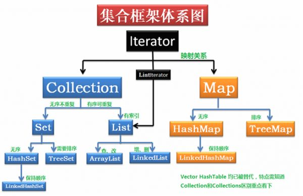

# Java集合（Collection & Map）
>Java集合类是一种特别有用的工具类（位于java.util包下），可用于存储数量不等的对象，并可以实现常用的数据结构，如栈、队列等。

### Collection 和 Iterator（迭代器）
#### Collection接口
+ Collection接口是List、Set、Queue接口的父接口。
+ Collection接口里面的方法：
