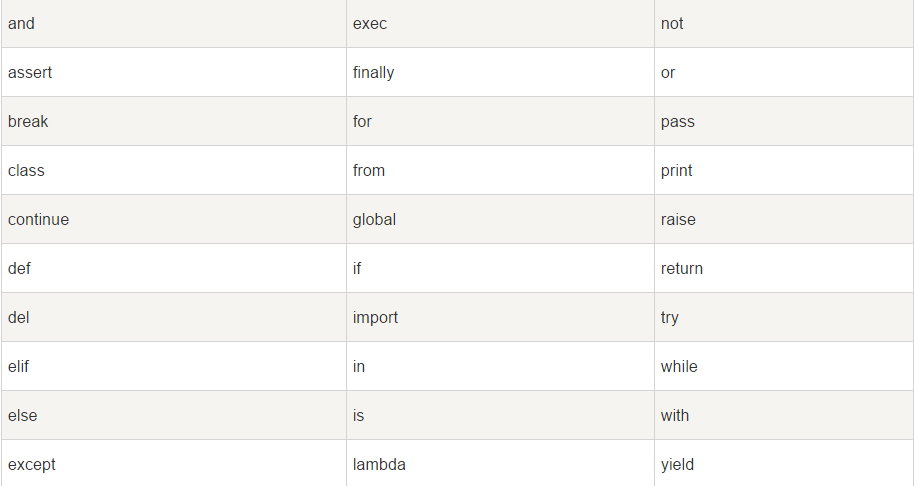

1.  交互式编程：

    不需要创建脚本文件，通过 Python 解释器的交互模式来编写代码，Windows上在安装Python时已经已经安装了默认的交互式编程客户端。
    ```Python
    在 python 提示符中输入以下文本信息：
    >>>print ("Hello,Python!");
    注意：在Python3.5.0中print后的语句要加()
    回车键后输出：
    Hello,Python!
    ```
2. 脚本式编程：
        Python文件都为.py为扩展名
3. Python标识符：

    * 在python里，标识符有字母、数字、下划线组成。
    * 在python中，所有标识符可以包括英文、数字以及下划线（_），但不能以数字开头。
    * python中的标识符是区分大小写的。
        * 以下划线开头的标识符是有特殊意义的。以单下划线开头（_foo）的代表不能直接访问的类属性，需通过类提供的接口进行访问，不能用"from xxx import *"而导入；
        * 以双下划线开头的（__foo）代表类的私有成员；以双下划线开头和结尾的（__foo__）代表python里特殊方法专用的标识，如__init__（）代表类的构造函数。
4. Python保留字符：

    这些保留字不能用作常数或者变数，或任何其他标识符名称，所以Python的关键字只包含小写字母。

    

5. 行和缩进：

    Python的代码块不用{}来控制类、函数以及其他逻辑判断，而是用缩进来写模块。
    缩进的空白数量是可变的，但是所有代码块语句必须包含相同的缩进空白数量，必须严格执行。(IndentationError: unindent does not match any outer indentation level:错误表明，使用的缩进方式不一致，有的是 tab 键缩进，有的是空格缩进，改为一致即可。)
    ```Python
    if True:
        print "True"
    else:
        print "False"
    ```
6. 多行语句：

    Python语句中一般以新行作为为语句的结束符。但是我们可以使用斜杠 \将一行语句分为多行显示。
    ```Python
    total = item_one + \
            item_two + \
            item_three
    ```
    语句中包含[], {} 或 () 括号就不需要使用多行连接符。
    ```Python
    days = ['Monday', 'Tuesday', 'Wednesday',
            'Thursday', 'Friday']
    ```
7. Python引号：

    Python可以使用引号（''）、双引号（""）、三引号（''' '''  或者 """  """）  来表示字符串，引号的开始与结束必须是相同类型的。（其中三引号可以由多行组成，编辑多行文本的快捷语法，常用于文档字符串，在文件的特定地点，被当做注释。）
    ```Python
    word = 'word'
    sentence = "这是一个句子"
    paragraph = """"这是一个段落。
    包含多个语句"""
    ```
8. Python注释：

    Python中单行注释采用 # 开头。

    ```Python
    #!/usr/bin/python
    # -*- coding: UTF-8 -*-
    # 文件名：test.py

    # 第一个注释
    print "Hello, Python!";  # 第二个注释
    ```

    python 中多行注释使用三个单引号(''' ''')或三个双引号(""" """)。

    ```Python
    '''
    这是多行注释,使用单引号
    '''
    """
    这是多行注释，使用双引号
    """
    ```
9. Python空行：

    函数之间或类的方法之间用空行分割，表示一段新的代码开始。类和函数入口之间也用一行空行分隔，以突出函数入口的开始。

    空行与代码缩进不同，空行并不是Python语法的一部分。书写时不插入空行，Python解释器运行也不会出错。但是空行的作用在于分隔两段不同功能或含义的代码，便于日后代码的维护或重构。

    空行也是程序代码的一部分。
10. 等待用户输入：
    ```Python
    raw_input("\n\nPress the enter key to exit.")
    ```
11. 同一行显示多条语句：

    Python可以在同一行中使用多条语句，语句之间使用分号(;)分割。
12. print 输出：

    print 默认输出是换行的，如果要实现不换行需要在变量末尾加上逗号。
13. 多个语句构成代码组：

    缩进相同的一组语句构成一个代码块，我们称之代码组

    像if、while、def和class这样的复合语句，首行以关键字开始，以冒号( : )结束，该行之后的一行或多行代码构成代码组。首行及后面的代码组称为一个子句(clause)。
14. 命令行参数：

    Python可以使用-h参数查看各参数帮助信息,在使用脚本形式执行 Python 时，可以接收命令行输入的参数，具体使用可以参照
    [Python命令行参数](http://www.runoob.com/python/python-command-line-arguments.html)
