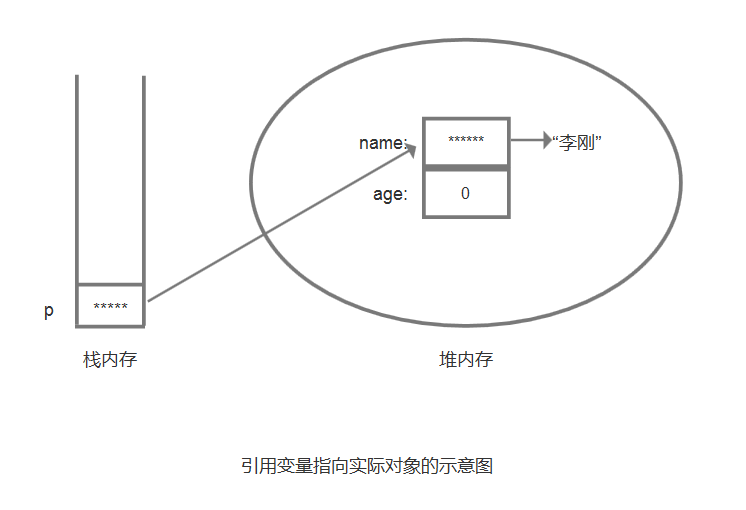
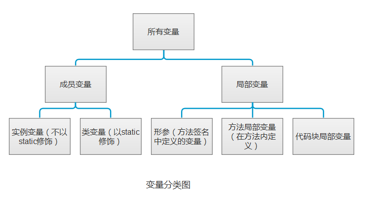
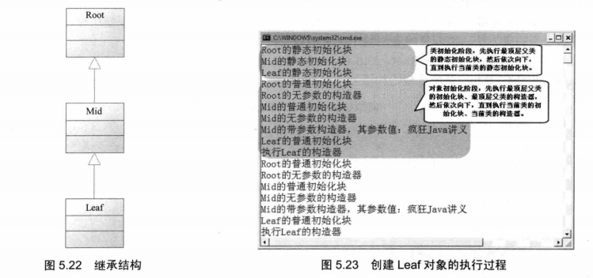

# 面向对象（上）
1. 面向对象的三个特征：封装、继承、多态
2. 类和对象：
  + 类：是某一批对象的抽象，也是一种引用数据类型。类定义中包含三种最常见的成员：构造器、成员变量和方法。（还有两种：初始化块、内部类）
  + 对象：是一个具体存在的实体。
    + 对象的产生和使用：
    ```java
    //定义p变量的同时为并为p变量赋值
    Person p = new Person();
    p.name = "ligang";
    p.say("Java");
    ```
    + 对象、引用和指针：
    ```java
    Person p = new Person();
    ```
    这行代码实际产生了两个东西：一个是p变量，一个是Person对象。程序中定义的Person类型的变量实际上是一个引用，他被存放在栈内存中里，指向实际的Person对象，而真正的Person对象则存放在堆（heap）内存中
    
3. 关键字`static`:
  + static 是一个特殊的关键字，它用于修饰方法、成员变量等成员。static 修饰的成员表明它属于这个类本身，而不是属于该类的单个实例，因而通常把 static 修饰的成员变量和方法也称为类变量、类方法或者静态变量和静态方法。`静态成员不能直接访问非静态成员`
  + static 修饰的方法和成员变量，既可以通过类来调用，也可以通过实例来调用。没有使用 static 修饰的方法和成员变量只可以通过实例来调用。
  + 一般来说,如果调用 static 修饰的成员（包括方法和成员变量）时省略了前面的主调，那么默认使用该类作为主调；如果调用没有 static 修饰的成员（包括方法和成员变量）时省略了前面的主调，那么默认使用 this 作为主调。
4. 关键字`this`：总是指向调用该方法的对象
  + 在构造器中引用该构造器正在初始化的对象
  + 在方法中引用调用该方法的对象，static修饰的方法不能用this引用。
  + 如果在某个方法中把this作为返回值，则可以多次连续调用同一个方法，从而使代码更简洁。
5. 方法相关：
  + 方法的参数传递机制：值传递。实质是当系统开始执行方法时，系统为参数执行初始化，就是把实参变量的值赋给方法的形参变量，方法里的操作并不是实际的实参变量。
  + 形参个数可变的方法：在定义方法时，在最后一个形参的类型之后增加三个点（...），则表明该形参可以接受多个参数值，多个参数值被当成数组传入。
  ```java
  public class Varargs{
    //定义了形参个数可变的方法
    public static void test(int a,String...books){
      for(String tmp:books){
        System.out.println(tmp);
      }
      System.out.println(a);
    }
    public static void main(String[] args) {
      test(5,"疯狂java讲义","轻量级Java EE企业应用实战");
    }
  }
  ```
  + 方法重载：如果同一个类里面包含了两个或两个以上的方法名相同，但形参列表不同，则被称为`方法重载`。系统可以根据形参列表的不同来区分这两个方法。
  ```java
  public void test(){
    System.out.println("无参数");
  }
  public void test(String msg){
    System.out.println("重载的test方法" + msg);
  }
  ```
6. 成员变量和局部变量：

  

  在使用局部变量时，应该尽可能的缩小局部变量的作用范围，局部变量的作用范围越小，它在内存中停留的时间就越短，程序运行性能就越好。
7. <font color="red">隐藏和封装：<font/>

  + 封装：指的是将对象的状态信息隐藏在对象内部，不允许外部程序直接访问对象的内部信息，而是通过该类所提供的方法来实现对内部信息的操作和访问。
  + 访问控制符：
    + private（当前类访问权限）：被修饰的成员只能在当前类的内部被访问。
    + default（包访问权限）：不使用任何访问修饰符，就称它是包访问权限的，default访问控制的成员或外部类可以被相同包下的其他类访问。
    + protected（子类访问权限）：被修饰的成员可以被同一个包中的其他类访问，也可以被不同包中的子类访问。通常情况下，使用protected类修饰一个方法，通常是希望其子类来重写该方法。
    + public（公共访问权限）：被修饰的成员或者外部类可以被所有类访问，不管访问类和被访问类是否处于同一个包中，是否具有父子继承关系。
8. 构造器：
  + 构造器是一个特殊的方法，这个特殊的方法用于创建实例时执行初始化，构造器是创建对象的重要途径，构造器最大的用处就是在创建对象时执行初始化。如果程序员没有为java类提供任何构造器，则系统会为这个类提供一个无参数的构造器。
  + 构造器重载：
  与方法重载基本相似，要求构造器名字相同，构造器必须与类名相同，多个构造器的参数列表必须不同。
  + 如果系统中包含了多个构造器，其中的一个构造器的执行体完全包含了另一个构造器的执行体，可使用this关键字另一个重载的构造器，而且该语句必须作为构造器执行体的第一条语句。
9. <font color="red">类的继承：<font/>

  + 继承的特点：单继承，每个子类只有一个直接父类。java的继承通过`extends`关键字来实现。子类扩展了父类，将可以获得父类的全部成员变量和方法。java.lang.Object类是所有类的父类。
  + 重写父类的方法：当父类的方法不适合子类时，需要进行方法重写（方法覆盖）。方法重写应该遵循“两同两小一大”规则：
    + 两同：方法名相同，形参列表相同。
    + 两小：子类方法返回值类型应该比父类方法返回值类型更小或相等；子类方法抛出的异常类应该比父类方法声明抛出的异常类更小或相等。
    + 一大：子类方法的访问权限应该比父类方法的访问权限更大或相等。
    + 如果父类方法具有private访问权限，则该方法对其子类是隐藏的，因此其子类无法访问该方法，也就是无法重写该方法。
  + super限定：
    + 如果需要在子类方法中调用父类被覆盖的实例方法，可用super限定来调用父类被覆盖的实例方法。在子类中定义的实例方法中可以通过super来访问父类中被隐藏的实例变量。
    + 当程序创建一个子类对象时，系统不仅会为该类中定义的实例变量分配内存，也会为它从父类继承得到的所有实例变量分配内存即使子类定义了与父类同名的实例变量。
  + 调用父类的构造器：
    + 子类不会获得父类的构造器，但子类构造器可以调用父类构造器的初始化代码。
    + 在一个构造器中调用另一个重载的构造器使用this调用来完成，在子类构造器中调用父类构造器使用super调用来完成。使用super调用父类构造器也必须出现在子类构造器执行体的第一行。
    + 子类构造器总会调用父类构造器一次：
            1.使用super显示调用父类构造器。
            2.使用this显示调用本类中重载的构造器，执行本类中的另一个构造器时会调用父类构造器。
            3.隐式调用父类无参数的构造器。
10. <font color="red">多态：（相同类型的变量，调用时总是呈现出多种不同的行为特征）

  + 多态性：
      + Java引用变量有两个类型：一个是编译时类型，一个是运行时类型。编译时类型由声明该变量时使用的类型决定，运行时类型由实际赋给该变量的对象决定。当两者不一致时，就会出现多态。
      + 当把一个子类对象直接赋给父类引用变量时，（如 `BaseClass p = new SubClass();` ），当运行时调用该引用变量的方法时，其方法行为总是表现出子类方法的行为特征，而不是父类方法的行为特征。
      + 与方法不同的是，对象的实例变量则不具备多态性。通过引用变量来访问其包含的实例变量时，系统总是试图访问他编译时类型所定义的成员变量，而不是他运行时类型所定义的成员变量。
      ```java
      BaseClass p =  new SubClass();
      System.out.println(p.book);//访问的是父类对象的实例变量。
      p.base();//执行从父类继承到的base()方法
      p.test();//执行当前类的test()方法
      //p.sub();
      /*
      因为p的编译时类型是BaseCalss，BaseCalss类没有提供sub()方法，所以上面代码编译时会出错
      */
      ```
  + 引用变量的强制类型转换：
      + 类型转换运算符是小括号`(type)variable`
      + 类型转换时应注意，基本类型之间的转换只能在数值类型（整型、字符型、浮点型）之间进行。数值型和布尔类型之间不能转换。引用类型之间的转换只能在具有继承关系的两个类型之间转换。
  + instanceof运算符：
    + instanceof运算符用于判断前面的对象是否是后面的类，或者其子类、实现类的实例，如果是返回true，否则返回false。
    + 在使用instanceof运算符时应注意：instanceof运算符前面操作数的编译类型要么与后面的类相同，要么与后面的类具有父子继承关系，否则会引起编译错误。
    ```java
    String a = "hello";
    //String类与Math类没有继承关系，所以下面代码编译无法通过
    System.out.println("字符串是否是Math类的实例：" + (a instanceof Math));
    ```
11. 继承与组合：
  + 继承和组合是实现类复用的重要手段，但继承破坏了封装，而组合方式则能提供跟更好的封装性。
  + 使用继承时：子类需要有额外增加的属性，而不仅仅是属性值的改变；子类需要增加自己独有的行为方式（包括增加新的方法或者重写父类的方法）
  + 使用组合时：是把旧类对象作为新类的成员变量组合进来，用以实现新类的功能。
  + 继承要表达的是一种`“是（is-a）”`的关系，而组合表达的是`“有（has-a）”`的关系。
12. 初始化块：
  +  初始化块是java类里面可出现的第4种成员，一个类里可以有多个初始化块。初始化块是一段固定执行的代码，他不能接受任何参数。初始化块只在创建Java对象时隐式执行，而且在构造器之前执行。
  + 如果定义初始化块时使用了static修饰符，则这个初始化块就变成了静态初始化块（类初始化块），系统将在类初始化阶段执行静态初始化块，而不是在创建对象时才执行。
  + java系统在加载并初始化某个类时，总是保证该类的所有父类（包括直接父类和间接父类）全部加载并初始化。
  
