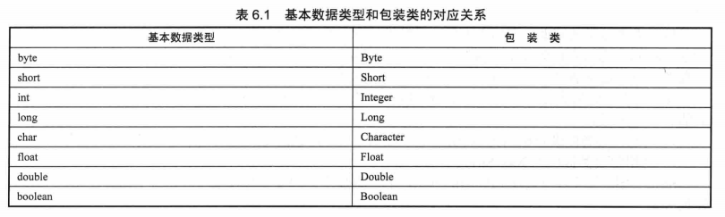
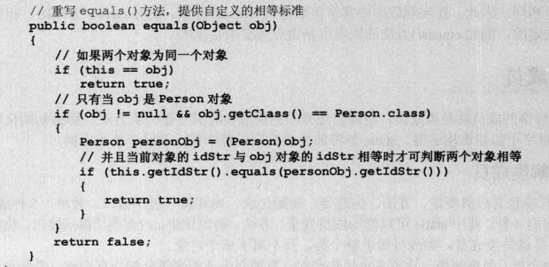

# 面向对象（下）
1. Java8增强的包装类：

  
  + JDK 1.5提供了自动装箱和自动拆箱功能，进行自动装箱和自动拆箱时必须注意类型匹配。
    + 自动装箱：把一个基本类型变量直接赋给对应的包装类变量，或者赋给Object变量。
    ```java
    Integer inObj = 5;
    Object boolObj = true;
    ```
    + 自动拆箱：直接把包装类对象赋给一个对应的基本类型变量。
    ```java
    int it = inObj;
    ```
  + 包装类还可以实现基本类型变量和字符串之间的转换：
    + 利用包装类提供的parseXxx(String s)静态方法（除了Character之外的所有包装类都提供了该方法）
    + 利用包装类提供的Xxx(String s)构造器。
    + String类提供了多个重载的valueOf()方法，用于将基本类型变量转换成字符串。另外，将基本类型变量和`""`进行运算连接，系统会自动把基本类型变量转换成字符串。
    ```java
    //字符串类型转换成为基本类型
    String intStr = "123";
    int it1 = Integer.parseInt(intStr);
    int it2 = new Integer(intStr);
    String floatStr = "4.56";
    float ft1 = Float.parseFloat(floatStr);
    float ft2 = new Float(floatStr);
    //基本类型转换成为字符串类型
    String ftStr  = String.valueOf(2.345f);
    String boolStr = String.valueOf(true);
    String in = 5 + "";
    ```
  + 虽然包装类型是引用数据类型，但包装类的实例可以与数值类型的值进行比较，这种比较是直接取出包装类实例所包装的数值来进行比较的。
  + 两个包装类实例进行比较时，只有两个包装类引用指向同一个对象时才会返回true。
  ```java
  System.out.println("比较两个包装类的实例是否相等：" + (new Integer(2) == new Integer(2)));//输出false
  ```
2. 处理对象：
  + toString方法：是一个“自我描述”方法，用于告诉外界该对象具有的状态信息。Object类提供的toString()方法总会返回该对象实现类的“类名 + @ + hashCode”值，这个返回值并不能真正实现“自我描述”的功能，需要重写Object类的toString()方法。
  ```java
  Person p = new Person("孙悟空");
  System.out.println(p);
  //输出结果：类名 + @ + hashCode
  ```
  重写toString()方法：
  ```java
  public String toString(){
    return "Apple[color = " + color + ",weight = " + weight + "]";
  }
  ```
  ```java
  Apple a = new Apple("红色"，5.68);
  //打印Apple对象
  System.out.println(a);
  //输出结果：Apple[color = 红色，weight = 5.86]
  ```
  + ==和equals方法：
    + `==`：
      + 当使用==来判断两个变量是否相等时，如果两个变量是基本类型变量，且都是数值类型（不一定要求数据类型严格相同），则只要两个变量的值相等，就返回true。
      + 对于两个引用变量，只有他们指向同一个对象时，==判断才会返回true。==不可以用于比较类型上没有父子继承关系的两个对象。
      ```java
      int i = 65;
      float f = 65.0;
      char ch = 'A';
      System.out.println(i == f);//返回true
      System.out.println(i == ch);//返回true
      String str1 = new String("hello");
      String str2 = new String("hello");
      System.out.println(str1 == str2);//返回false
      ```
      + 当使用new String("hello")时，新创建的String对象被保存在堆内存中；对于“hello”字符串直接量，JVM将会使用常量池来管理这些字符串。
    + equals()方法：
      + equals()方法是Object类提供的一个实例方法，默认只是比较对象的地址，所以使用这个方法判断两个对象相等的标准与==运算符没有区别，常常需要重写equals方法来实现。
      
3. 类成员：
  + 理解类成员：
    + 在Java类的成员中，static可以修饰成员变量、方法、初始化块、内部类（包括接口、枚举），static修饰的成员就是类成员。
    + 类成员既可以通过类来访问，也可通过类的对象来访问，但实际上使用实例来访问类成员时，实际上是委托给该类来访问类成员。
    + 类成员不能访问实例成员。
  + 单例（Singleton）类：
    + 如果一个类始终只能创建一个实例，则这个类被称为单例类。
    + 创建单例类时候，类的构造器应该使用private修饰；并且提供一个public方法作为该类的访问点，用于创建该类的对象，且该方法必须使用static修饰；另外，该类还需要一个成员变量来保存曾经创建的对象。
    ```java
    class Singleton{
      private static Singleton instance;
      private Singleton(){}
      public static Singleton getInstance(){
        if(instance==null){
          instance = new Singleton;
        }
        return instance;
      }
    }
    public class SingletonTest{
      public static void main(String[] args){
        Singleton s1 = Singleton.getInstance();
        Singleton s2 = Singleton.getInstance();
        system.out.println(s1 == s2);//将输出true
      }
    }
    ```
