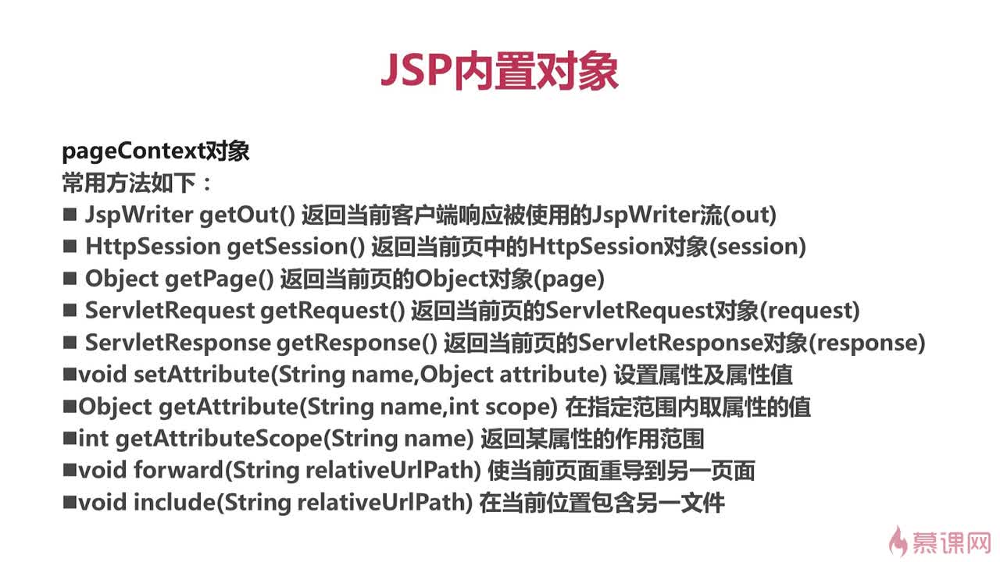

### JSP-JAVAEE
1. JSP基础语法：
  + JSP简介：JSP全名Java Server Pages，其根本是一个简化的Servlet设计，他实现了在java当中使用HTML标签，JSP是一种动态网页技术标准也是JAVAEE的标准，JSP与Servlet一样，是在服务器端执行的
  + jsp页面组成内容：
    + 指令：
    >Page指令：通常位于jsp页面的顶端，同一个页面可以有多个page指令      
    语法如下 ：

    ```js
    <%@ page 属性一="属性值" 属性二="属性值"...... %>
    ```  
    

      >include指令：将一个外部文件嵌入到当前jsp文件中，同时解析这个页面中的jsp语句。   
      taglib指令：使用标签库定义新的自定义标签，在jsp页面中启用定制行为

    + 表达式：在jsp页面中执行的表达式
    ```js
    <%= 表达式 %>  //注意：表达式不以分号结束
    ```
    + 小脚本：在jsp页面中执行的java代码，语法：
    ```js
    <% java代码 %>
    ```
    + 声明：在jsp页面中定义变量或者方法
    ```js
    <%! java代码 %>
    ```
    + 注释:`<%--注释内容--%>`  客户端不可见
    + jsp页面生命周期：
    
    jsp.Service()方法被调用用来处理客户端的请求，对于每一个请求，jsp引擎创建一个新的线程来处理该请求，如果有多个客户端同时请求该jsp文件，则jsp会创建多个线程，每个客户端请求对应一个线程，以多线程方式执行可以大大降低对系统的资源需求，提高系统的并发量及响应时间，但也要注意多线程的编程带来的同步问题，由于Selvert始终驻于内存，所以响应是非常快的。
    + 静态内容
2. JSP内置对象：是Web容器创建的一组对象，不是要new关键词就可以使用的内置对象
  + out：是JspWriter类的实例，是向客户端输出内容常用的对象，常用方法如下：
    + void println()：向客户端打印字符串
    + void clear()：清除缓冲区内容，如果在flush之后调用会抛出异常
    + void clearBuffer()：清除缓冲区内容，如果在flush之后调用不会抛出异常
    + void flush()：将缓冲区内容输出到客户端
    + int getBufferSize()：返回缓冲区以字节数的大小，如不设缓冲区则为0
    + int getRemaining()：返回缓冲区还剩多少可用
    + boolean isAutoFlush()：返回缓冲区已满时，是自动清空还是抛出异常
    + void close()：关闭输出流
    + 缓冲区（Buffer）：内存的一块区域用来保存临时数据
  + request(请求)：客户端的请求信息被封装在request对象中，通过他才能了解客户的需求，然后做出响应。他是HTTPServletRequest类的实例。request对象具有请求域，即完成客户端的请求之前，该对象一直有效。常用方法如下：
    + String getParameter(String name)--返回name指定参数的参数值（单个值）
    + String[] getParameterValues(String name)--返回包含参数name的所有值的数组（参数的集合）
    + void setAttritube(String,Object)--存储此请求中的属性（参数为一个键值对）
    + object getAttritube(String name)--返回指定属性的属性值（参数为一个键）
    + String getContentType()--得到请求体的MIME类型
    + String getProtocol()--返回请求用的协议类型及版本号
    + String getServerName()--返回接收请求的服务器主机名
    + void setCharacterEncoding(String str)--参数为`utf-8`时，可以解决中文乱码。设置请求的字符编码方式
    + String getCharacterEncoding()--返回字符编码方式
    + int getServerPort()--返回服务器接受此请求所用的端口号
    + int getContentLength()--返回请求体的长度（以字节数）
    + String getRemoteAddr()--返回发送此请求的客户端IP地址
    + String getRealPath(String path)--返回一虚拟路径的真实路径
    + String getContextPath()--返回上下文路径
  + response(响应)：response对象包含了响应客户请求的有关信息，但在jsp中很少直接使用到。他是HTTPServletResopnse类的实例。response对象具有页面作用域，即访问一个页面时，该页面内的response对象只能对这次访问有效，其他页面的response对象对当前页面无效。常用方法如下：
    + String getCharacterEncoding()--返回响应用的是何种编码
    + void setContentType(String type)--设置响应的MIME类型
    + PrintWriter getWriter()--返回可以向客户端输出字符的一个对象（输出提前于内置out对象）
    + sendRedirect()--重新定向客户端的请求
  + session：表示客户端与服务器的一次会话。Web中的session指的是用户在浏览某个网站时，从进入网站到浏览器关闭所经过的这段时间，也就是用户浏览这个网站所花费的时间。session实际上是一个特定的时间概念。服务器内存中保存着不同的session，不同的用户对应不同的session。
    + session对象是一个jsp内置对象
    + session对象在第一个jsp页面被装载时自动创建，完成会话期管理
    + 一个生命周期：从一个客户打开浏览器并连接到服务器开始，到客户关闭浏览器离开这个浏览器结束，被称为一个会话。
    + 当一个客户访问一个服务器时，可能会在服务器的几个页面之间切换，服务器应当通过某种办法知道这是一个客户，就需要session对象，他是保存用户状态的一种机制
    + session是HttpSession类的实例
    + session对象的常用方法：
    ```
    1>.long getCreationTime()--返回session创建的时间
    2>.public String getId()--返回session创建时jsp引擎为他设的唯一的id号
    3>.public void setAttritube(String name,Object value)--使用指定名称将对象绑定到此会话
    4>.public Object getAttritube(String name)--返回此会话中与指定名称绑定在一起时的对象，如果没有对象绑定在改名称下，则返回null
    5>.String[] getValueNames()--返回一个包含此session中所有可用属性的数组
    6>.void setMaxInactiveInterval()--设置一个session的生存时间
    7>.int getMaxInactiveInterval()--返回两次请求间隔多长时间此session被取消（单位：s）
    ```
    + session 的生命周期：
    ```
    1.创建：当客户端第一次访问某个jsp或者Servlet时候，服务器会为当前session创建一个SessionId，每次客户端向服务端发送请求时，都会将此SessionId携带过去，服务端会对此SessionId进行校验
    2.活动：某次会话通过超链接打开新的页面属于同一次会话；只要当前会话页面没有全部关闭，重新打开浏览器窗口访问同一项目资源时属于同一次会话。除非本次会话的所有页面都关闭后再重新访问某个jsp或者Servlet将会创建新的会话（原有会话还存在，只是这个旧的SessionId仍然存在于服务端，只不过再也没有客户端会携带他然后交予服务端校验）。
    3.销毁：
          1）调用session.invalidate()方法
          2）Session过期，Tomcat默认session超时时间为30分钟
          3）服务器重新启动
      设置session超时的两种方法：
      * session.setMaxInactiveInterval(时间);//单位是秒
      * 在web.xml中配置：（单位为分钟）
      <session-config>
      <session-timeout>
          10
      </session-timeout>
      </session-config>
    ```
  + application：
    + application对象实现了用户数据的共享，可以存放全局变量
    + application对象开始于服务器的启动，终止于服务器的关闭
    + 在用户的前后连接或者不同用户的连接中，可以对application对象的同一属性进行操作
    + 在任何地方对application对象属性的操作，都将影响到其他用户对此的访问
    + 服务器的启动和关闭决定了application对象的生命
    + application对象是ServletContext类的实例
    + 常用方法：
    ```
    1).public void setAttritube(String name,Object value)--使用指定名称将对象绑定到此会话
    2).public Object getAttritube(String name)--返回此会话中与指定名称绑定在一起时的对象，如果没有对象绑定在改名称下，则返回null
    3).Enumeration getAttritubeNames()--返回所有可用属性名的枚举
    4).String getServerInfo()--返回jsp（SERVER）引擎名及版本号
    ```
  + Page对象：Page对象就是指向当前jsp页面本身，类似于类中的this指针，他是jav.lang.Object类的实例，常用方法如下：
    + class getClass()--返回此object的类
    + int hashCode()--返回此Object的hash码
    + boolean equals(Object obj)--判断此object是否与指定的object对象相等
    + void copy(Object obj)--把此object拷贝到指定的 object对象中
    + Object clone()--克隆此object对象
    + String toString()--把此object对象转换成String类的对象
    + void noyify()--唤醒一个等待的线程
    + void notifyAll()--唤醒所有等待的线程
    + void wait(int timeout)--使一个线程处于等待直到timeout结束或被唤醒
    + void wait()--使一个线程处于等待知道被唤醒
  + PageContext对象：
    + PageContext对象提供了对jsp页面内所有对象及名字空间的访问
    + PageContext对象可以访问到本页所在的session，也可以取本页面所在的application的某一属性值
    + PageContext对象相当于页面中所有功能的集大成者
    + PageContext对象本类名也叫pageContext
    + 常用方法：
    
  + exception：是一个异常对象，当一个页面在运行过程中发生了异常，就产生这个对象。如果一个jsp页面要应用此对象，就必须把isErrorPage设为true，否则无法编译。他实际上是java.lang.Throwable的对象，常用方法如下：
    + String getMessage()--返回描述异常的消息
    + String toString()--返回关于异常的简短消息描述  
    + void printStackTrace()--显示异常及其栈轨迹
    + Throwable FillInStackTrace()--重写异常的执行栈轨迹
  + config:config对象是在一个Servlet对象初始化时，jsp引擎向他传递信息用的，此信息包括Servlet初始化时所要用到的参数（通过属性名和属性值构成）以及服务器有关的信息（通过传递一个ServletContext对象），常用方法如下：
    + ServletContext getServerContext()--返回含有服务器相关信息的ServletContext对象
    + String getInitParameter(String name)--返回初始化参数的值
    + Enumeration getInitParameterNames()--返回Servlet初始化时所需的所有参数的枚举
3. 表单提交方式 get 和 post 提交方式：
  + get：以明文的方式通过URL提交数据，数据在URL中可以看见，提交的数据最多不超过2KB。安全性较低但效率比post方式高，适合提交数据量不大，安全性不高的数据。比如：搜索查询功能
  + post：将用户提交的信息封装到HTML HEADER内。适合提交数据量大，安全性高的用户信息。比如：注册，修改，上传等功能。
4. MIME类型：MIME类型就是设定某种扩展名的文件用一种应用程序来打开的方式类型，当该扩展名文件被访问的时候，浏览器会自动使用指定应用程序来打开。多用于指定一些客户端自定义的文件名，以及一些媒体文件打开方式。
5. 请求重定向和请求转发：
  + 请求重定向：客户端行为，response.sendRedirect()，从本质上讲等同于两次请求，前一次的请求对象不会保存，地址栏的URL会发生变化
  + 请求转发：服务器行为，requst.getRequestDispatcher().forword(req,resp);是一次请求，转发后请求对象会保存，地址栏的URL地址不会发生变化
6. javaBeans：
  + javabean：就是符合某种特定符规范的Java类。使用JavaBeans的好处是解决代码重复编写，减少代码冗余，功能区分明确，提高了代码的维护性
    + 设计原则：共有类，无参的构造方法，属性私有，getter和setter的方法
  + jsp动作元素：动作元素为请求处理阶段提供信息，动作元素遵循xml元素的语法，有一个包含元素名的开始标签，可以有属性、可选的内容、与开始标签匹配的结束标签。
    + 与存取JavaBean有关的，包括：
    ```
    1. <jsp:useBean>--在jsp页面中实例化或者在指定范围内使用Javabean：<jsp:useBean id="标识符" class=java类名"" scope="作用范围"/>
    2. <jsp:setProperty>--给已经实例化的JavaBean对象的属性赋值，共有四种形式：   
    `<jsp:setProperty name="JavaBean实例名" property="*"/>`（跟表单关联，自动匹配所有属性）   
    `<jsp:setProperty name="JavaBean实例名" property="JavaBean属性名"/>`（跟表单关联，匹配部分属性）   
    `<jsp:setProperty name="JavaBean实例名" value="BeanValue"/>`（手工设置）   
    `<jsp:setProperty name="JavaBean实例名" property="propertyName" param="request对象中的参数名"/>`（跟request参数关联）
    3. <jsp:getProperty>
    ```
