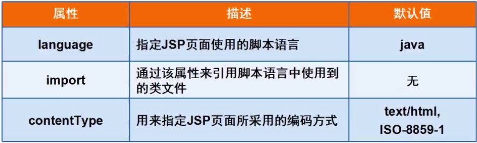
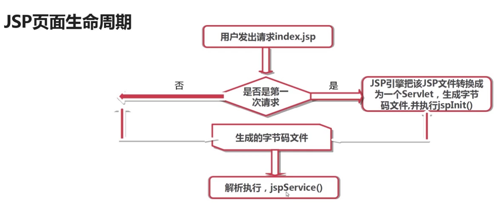

### JSP-JAVAEE
1. JSP基础语法：
  + JSP简介：JSP全名Java Server Pages，其根本是一个简化的Servlet设计，他实现了在java当中使用HTML标签，JSP是一种动态网页技术标准也是JAVAEE的标准，JSP与Servlet一样，是在服务器端执行的
  + jsp页面组成内容：
    + 指令：
    >Page指令：通常位于jsp页面的顶端，同一个页面可以有多个page指令      
    语法如下 ：

    ```js
    <%@ page 属性一="属性值" 属性二="属性值"...... %>
    ```  
    

      >include指令：将一个外部文件嵌入到当前jsp文件中，同时解析这个页面中的jsp语句。   
      taglib指令：使用标签库定义新的自定义标签，在jsp页面中启用定制行为

    + 表达式：在jsp页面中执行的表达式
    ```js
    <%= 表达式 %>  //注意：表达式不以分号结束
    ```
    + 小脚本：在jsp页面中执行的java代码，语法：
    ```js
    <% java代码 %>
    ```
    + 声明：在jsp页面中定义变量或者方法
    ```js
    <%! java代码 %>
    ```
    + 注释:`<%--注释内容--%>`  客户端不可见
    + jsp页面生命周期：
    
    jsp.Service()方法被调用用来处理客户端的请求，对于每一个请求，jsp引擎创建一个新的线程来处理该请求，如果有多个客户端同时请求该jsp文件，则jsp会创建多个线程，每个客户端请求对应一个线程，以多线程方式执行可以大大降低对系统的资源需求，提高系统的并发量及响应时间，但也要注意多线程的编程带来的同步问题，由于Selvert始终驻于内存，所以响应是非常快的。
    + 静态内容
2. JSP内置对象：是Web容器创建的一组对象，不是要new关键词就可以使用的内置对象
  + out：是JspWriter类的实例，是向客户端输出内容常用的对象，常用方法如下：
    + void println()：向客户端打印字符串
    + void clear()：清除缓冲区内容，如果在flush之后调用会抛出异常
    + void clearBuffer()：清除缓冲区内容，如果在flush之后调用不会抛出异常
    + void flush()：将缓冲区内容输出到客户端
    + int getBufferSize()：返回缓冲区以字节数的大小，如不设缓冲区则为0
    + int getRemaining()：返回缓冲区还剩多少可用
    + boolean isAutoFlush()：返回缓冲区已满时，是自动清空还是抛出异常
    + void close()：关闭输出流
  + request(请求)
  + response(响应)
  + session
  + application
  + Page/PageContext/exception/config
