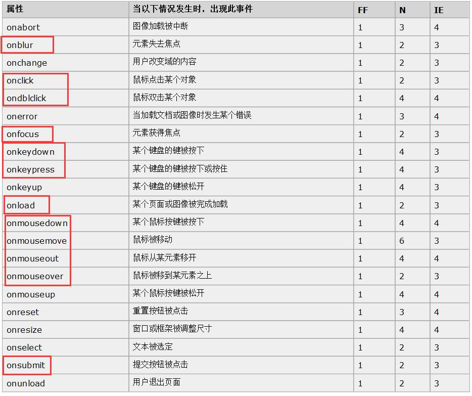
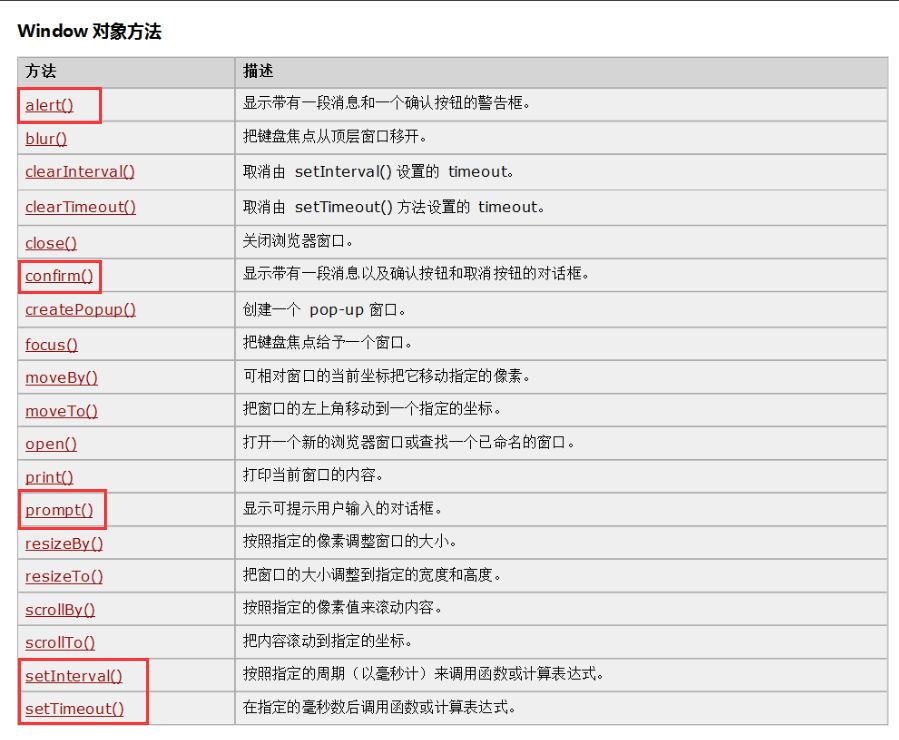
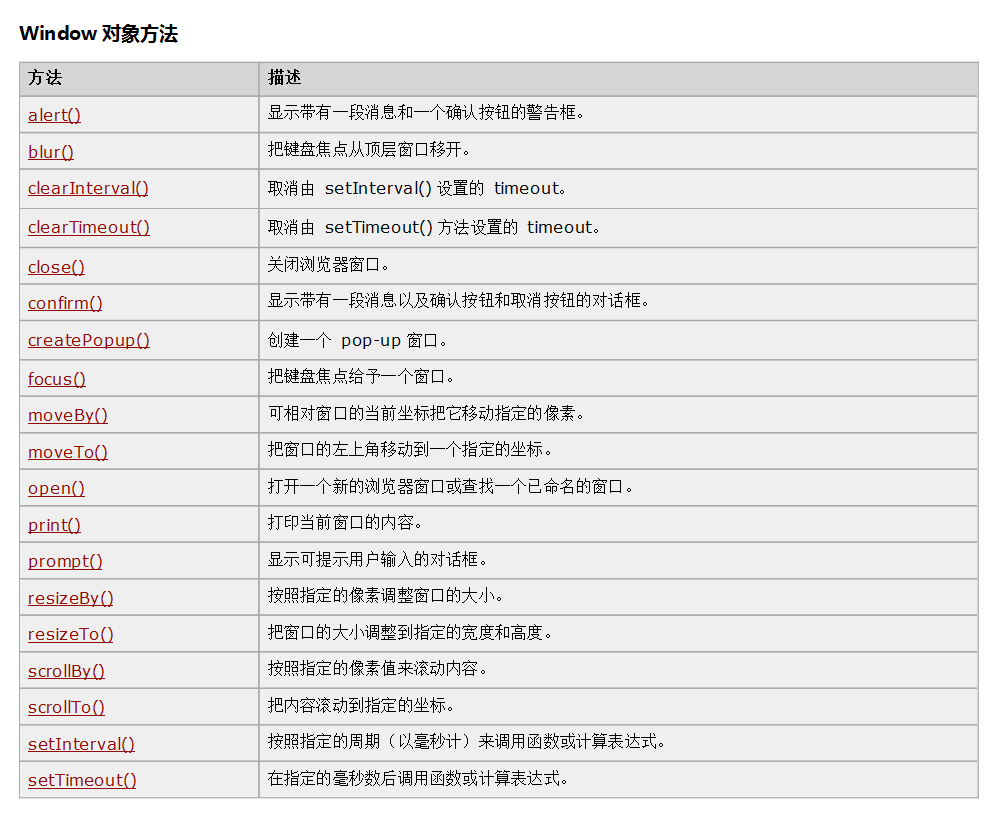
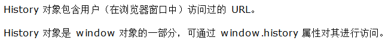
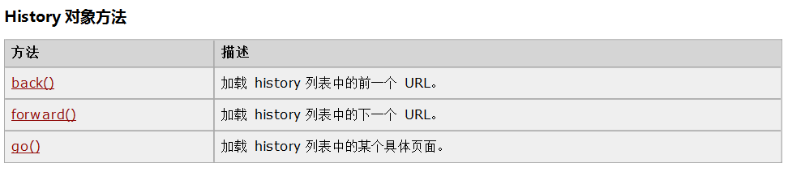
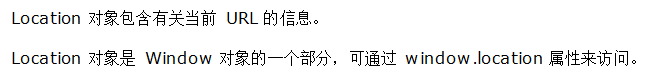
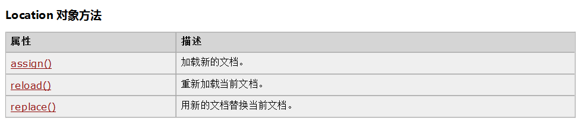
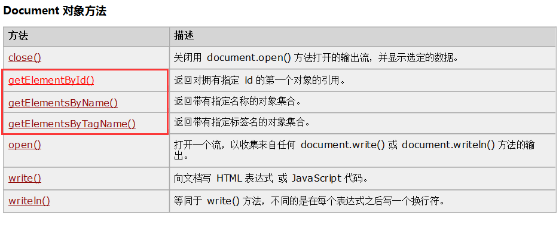
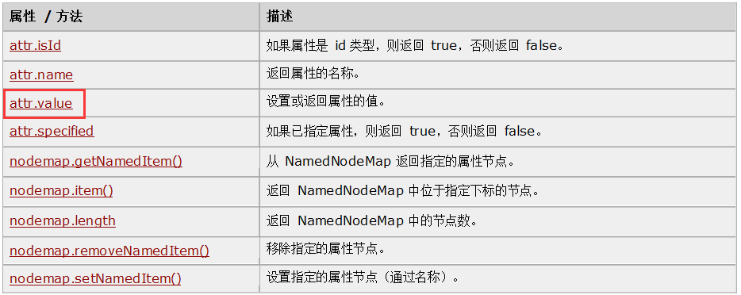
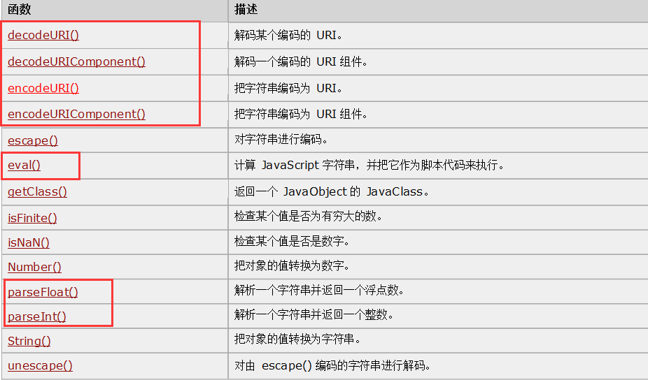

#### JavaScript 简介
> HTML：是整个网站的骨架   
css：他是对整个网站骨架的内容进行美化（修饰）   
JavaScript：能够让整个页面具有动态效果，向HTML页面添加交互行为，是一种脚本语言。主要应用：嵌入动态文本于HTML页面、对浏览器事件作出响应、读写HTML文件、验证提交数据、检测访客的浏览器信息

1. javascript的组成部分：
  + ECMAScript：是整个JavaScript的核心部分，包含基本语法、变量、关键字、保留字、数据类型、语句、函数等
  + DOM：文档对象模型，包含整个HTML页面的内容
  + BOM：浏览器对象模型，包含整个浏览器相关的内容
2. ECMAScript：
  + 变量、函数名、运算符以及其他都`区分大小写`
  + 变量是`弱类型`的：定义变量时只用`var`运算符，可以将它初始化为任意值，因此可以随时改变变量所存数据类型（尽量避免这样做），变量可以不用声明，默认值为 undefined
  ```javascript
  var color="red";
  var num=25;
  var visible=true;
  ```
  + 关键字和保留字：与java中类似，不能用作变量名
  + 五种原始类型（基本类型）：对变或值调用typeof（有一个参数）运算符，返回要检查的变量或值的类型
    + Undefined：声明未定义（赋值）
    + boolean：有两个值true和false
    + number：表示任意数字
    + string：由双引号或单引号声明
    + object：若变量为引用类型或null类型（表示空，一个占位符）
  + 引用类型：
    + 引用类型通常叫做类（class），也就是说，遇到引用类型，所处理的就是对象
    + javascript是基于对象不是面向对象，对象默认值为null
    + javascript提供众多预定义的引用 类型（内置对象）
  + 运算符：大部分与java中一样，特殊：等性运算符
    +  判断两值相等用 == ，判断两值不等用 ！=
    +  运算符两边变量类型不一致时，执行类型转换规则：数字>字符串>对象>Boolean
    + 全等运算符（===）：值和类型全等
    ```javascript
    var x1=5;
    var x2="5";
    alert(x1===x2);//值为false
    ```
  + 语法：
    + if语句
    + for语句
    + while语句
    + switch语句
    + break/continue语句
    + 标签语句：可以使用下列语句给语句加标签，以便以后调用
    ```javascript
    // 语法
    label: statement;
    // 例子
    start:i=5;
    ```
    + with语句：用于设置代码在特定对象中的作用域
    ```javascript
    // 语法
    with (expression) statement;
    // 例子
    var sMessage="hello";
    with(sMessage){
      alert(toUpperCase());
    }
    ```
+ JavaScript的引入：在HTML文件中有两种引入JavaScript的引入方式：
  + 内嵌式：HTML文件直接嵌入JavaScript脚本，通过`<script>` 标签引入
  ```javascript
  <script type="text/javascript">
  // 此处为JavaScript代码  
  </script>
  ```
  + 外联式：在HTML文件中，通过`<script src="">`的标签引入`.js`文件
  ```javascript
  <script src="1.js" type="text/javascript" charset="utf-8"></script>
  ```
+ 基本操作：
  + javascript的输出：
    + alert():向页面弹出一个提示框
    + innerHTML():向页面的某个元素中写一段内容，将原有内容覆盖
    + document.write()：向页面中写内容
  + 获取元素：
    + document.getElementById("id名称");获取元素
    + document.getElementById("id名称").value;获取元素里面的值
+ javascript事件：
  + 1-表单提交事件：onsubmit，该事件放在`form`标签中，必须有返回值
  >1.确定事件（onsubmit）并为其绑定一个函数   
  2.书写这个函数（获取用户输入的数据，获取数据时需要在指定位置定义一个id）   
  3.对用户输入的数据进行判断   
  4.数据合法（让表单提交）   
  5.数据非法（给出错误提示信息，不让表单提交）   
  ```javascript
  // 需要在定义函数的时候给出一个返回值
  onsubmit = return checkForm()
  ```

  利用js完成注册表单数据校验：
  ```javascript
    <!DOCTYPE html>
    <html>
    <head>
    	<meta charset="UTF-8">
    	<title>获取元素</title>
    	<script>
    //			window.onload = function(){
    //				//获取页面指定位置的元素
    //				var uEle = document.getElementById("username");
    ////				alert(uEle);
    //				//获取页面指定位置的内容（值）
    //				var uValue = uEle.value;
    //				alert(uValue);
    //			}
    		function checkForm(){
    //				alert("aa");
    			//校验用户名
    			var uValue = document.getElementById("username").value;
    			if(uValue==""){
    				alert("用户名不能为空！");
    				return false;
    			}
    			//校验密码
    			var pValue = document.getElementById("password").value;
    			if(pValue==""){
    				alert("密码不能为空！");
    				return false;
    			}
    			//再次输入密码
    			var repValue = document.getElementById("repassword").value;
    			if(repValue!=pValue){
    				alert("两次输入密码不一致！");
    				return false;
    			}
    			//校验邮箱，使用正则表达式查看邮箱格式是否正确
    			var eValue = document.getElementById("email").value;
    			if(!/^([a-zA-Z0-9_-])+@([a-zA-Z0-9_-])+(.[a-zA-Z0-9_-])+/.test(eValue)){
    				alert("邮箱格式不正确！");
    				return false;
    			}

    		}
    	</script>
    </head>
    <form action="#" method="get" name="regForm" onsubmit="return checkForm()">
    	用户名：<input type="text" name="username" id="username"><br />
    	密码：<input type="password" name="password" id="password"/><br />
    	再次输入密码：<input type="password" name="repassword" id="repassword" /><br />
    	邮箱：<input type="text" name="email" id="email"/><br />
    	<input type="submit" value="注册" />

    </form>
    </html>

      ```
      js中正则匹配的两种方式：
          1） 使用String对象中的 match 方法
          2） 使用正则对象中的 test 方法     
      js中函数编写方式：
          1） 关键字 funcation ，函数名自定义
   ```javascript
   <script type="text/javascript">
    //  方式一：声明函数
    function demo1(){
      alert("案例一");
    }
    // 方式一：调用函数
    demo1();
     </script>
    //  方式二：声明匿名函数
     var demo2 = function(){
       alert("案例二");
     }
    //  方式二：调用函数
    demo2();  
   ```

 + 2-页面加载事件：onload，该事件只能写一次且必须放在`body`标签中
    + 定时操作函数：按照指定的周期（间隔）来执行函数和代码片段
 ```javascript
//  定时操作
window.setInterval(code,millisec)
 ```
          1）参数一code：必须，执行的函数名或代码片段
          2）参数二millisec：必须，时间间隔，单位：毫秒
          3）返回值：一个可以传递给window.clearInterval()从而取消对code的周期性执行的值
          4）window 对象提供的都是全局函数，调用函数时window可以省略
    ```javascript
    function init(){
			//书写图片定时显示的函数操作
			window.setInterval("changeImg()",3000);
		}
		var i = 0;
		function changeImg(){
			i++;
			document.getElementById("img1").src="../img/" + i + ".jpg";
			if(i==4){
				i = 0;
			}
		}
    ```
    + 隐藏图片：使用`display:none`
  + 3-聚焦事件/离焦事件：onfocus/onblur，放在需要操作的元素位置，常用于表单校验的时候
  + 4-点击事件/双击事件：onclick/ondblclick，放在需要操作的元素位置
  + 5-鼠标移入事件/移出事件/鼠标移动：onmouseover/onmouseout/onmousemove，放在需要操作的元素的位置，购物网站商品详情页
  + 6-键盘被按下或按住：onkeydown/onkeypress，搜索引擎使用比较多
  + 7-onchange:用户改变内容的时候使用这个事件（二级联动）
  

6. Browser对象：
  + Windows对象
  
  
  + History对象
  
  
  + Location对象
  
  
  + Navigator对象
  + Screen对象
7. js的DOM操作：
  + Document对象：整个HTML文档都称之为一个Document文档
  
  后两个方法获取后需要遍历
    + 以下两个方法很重要，但是在手册中查不到
            创建文本节点：document.createTextNode()
            创建元素节点：document.createElement()
  ```javascript
  var ulEle = document.getElementById("ul1");
	//创建城市文本节点
	var textNode = document.createTextNode("广东");//广东
	//创建li元素节点
	var liEle = document.createElement("li");//<li><li>
	//将城市文本节点添加到元素节点li中
	liEle.appendChild(textNode);//<li>广东<li>
	//将li添加到ul中去
	ulEle.appendChild(liEle);
  ```
  + Element对象：HTML中所有标签都是element元素
    + element.appendChild() 向元素添加新的子节点，作为最后一个子节点。
    + element.firstChild 返回元素的首个子节点。
    + element.getAttribute() 返回元素节点的指定属性值。
    + element.innerHTML 设置或返回元素的内容。
    + element.insertBefore() 在指定的已有的子节点之前插入新节点。
    + element.lastChild 返回元素的最后一个子元素。
    + element.setAttribute() 把指定属性设置或更改为指定值。
  + Attribute对象：HTML中所有标签的属性都是Attribute对象
  

8. 其他标签：
  ```javascript
  // 表头
  <thead>
    <tr>
      <th>
      </th>
    </tr>
  </thead>
  // 表格主体
  <tbody>
    <tr>
      <td>
      </td>
    </tr>
  </tbody>
  ```

9. javascript内置对象：
  + Array对象：Array对象用于在单个的变量中存储多个值，数组的长度可变，`数组的长度=最大脚标+1`
  ```javascript
  // 语法：
  new Array();
  new Array(size);
  new Array(element0,element1,element3……);
  //创建一个二维数组，用于存储省份和城市
  var cities = new Array(3);
  cities[0] = new Array("武汉市", "黄冈市", "襄阳市", "荆州市");
  cities[1] = new Array("长沙市", "郴州市", "株洲市", "岳阳市");
  cities[2] = new Array("石家庄市", "邯郸市", "廊坊市", "保定市");
  cities[3] = new Array("郑州市", "洛阳市", "开封市", "安阳市");
  ```
  + Boolean对象：如果value不写，则默认创建的结果为false
  ```javascript
  // 创建语法，构造函数
  new Boolean(value);
  Boolean(value);
  ```
  + Date对象：用于处理日期和时间，解决浏览器缓存问题
    + getTime()：返回1970年1月1日至今的毫秒数
  + Math对象和Number对象：与java里面基本一致
  + String对象：用于处理文本（字符串）
  ```javascript
  new String(s);
  String(s);
  ```
    + match()：找到一个或多个正则表达式的匹配
    + substr()：从起始索引号提取指定数目的字符
    ```javascript
    var str = "-a-b-c-d-e-f-";
		var str1 = str.substr(2,4);
		alert(str1);//输出-b-c
    ```
    + substring()：提取字符串中两个指定的索引号之间的字符
    ```javascript
    var str = "-a-b-c-d-e-f-";
    var str2 = str.substring(2,4);
		alert(str2);//输出-b
    ```
  + RegExp对象：表示正则表达式，他是对字符串执行模式匹配的强大工具
    + test()： 检索字符串中指定的值，返回true或false

10. javascript全局函数（Functions）：全局属性和函数可用于所有内建的 javaScript对象

```javascript
// 编码和解码
var str = "张三";
//把字符串编码为URI
alert(encodeURI(str));//%E5%BC%A0%E4%B8%89
//把字符串编码为URI组件
alert(encodeURIComponent(str))//%E5%BC%A0%E4%B8%89
//解码某个编码的URI
alert(decodeURI(encodeURI(str)));//张三
//解码某个编码的URI组件
alert(decodeURIComponent(encodeURIComponent(str)));//张三
var str1 = "https://www.baidu.com/"
//把字符串编码为URI
alert(encodeURI(str1));//https://www.baidu.com/
//把字符串编码为URI组件
alert(encodeURIComponent(str1))//https%3A%2F%2Fwww.baidu.com%2F
//解码某个编码的URI
alert(decodeURI(encodeURI(str1)));//https://www.baidu.com/
//解码某个编码的URI组件
alert(decodeURIComponent(encodeURIComponent(str1)));//https://www.baidu.com/
```
```javascript
// eval()
var str2 = "alert('abc')";
alert(str2);//alert('abc')
eval(str2);//abc
```
