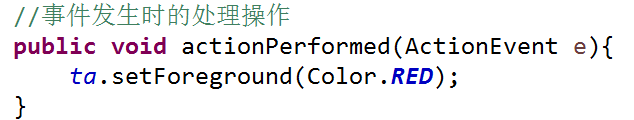
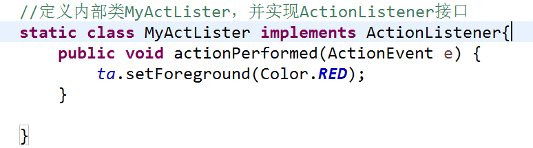
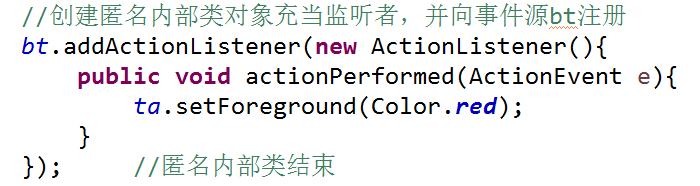

事件处理：
===
为组件设计相应的程序，使组件能响应并处理用户的操作

1. 相关概念：

  * 事件
  * 事件源
  * 事件监听者：Java 程序把对事件进行处理的方法放在一个类对象中，这个类对象就是事件监听者。
  * 事件处理程序：Java 语言的 *java.awt.event* 包和 * javax.swing.event* 包中包含许多用来处理事件的接口和类。这些包含事件处理方法的接口成称为监听者接口，包含事件处理方法的类称为适配器类。

2. 委托事件模型：（即事件源将事件处理任务委托给监听者）
  * 委托事件模型是由事件源、事件对象、事件监听者对象之间的关系组成的。
  * 为了让“事件源”知道要把事件信息传递给哪一个“事件监听者”，事先必须把“事件监听者”向“事件源”注册。 **“组件名”.addXXXListener(监听者对象)**
  * 该模型中可以有多个事件监听者。一个监听者可以为多个事件源服务，一个事件源可以有多个相同或不同类型的监听者。
  * 监听者：
    * 让包含“事件源”的容器对象来担任监听者。
      

      
    * 定义内部类并让内部类对象来担任监听者。
      * 即把实现监听者接口的类定义在主类中，使之成为其内部类，内部类可以访问外部类的成员方法与成员变量，包括私有成员。一般声明该类为 private ,有时也声明为 static 。
      

        
    * 使用匿名内部类来担任监听者。
        

3. Java 语言的事件类：
  * 事件监听者对应接口一般位于 *java.awt.event* 或 *javax.swing.event* ，其中定义的接口一般以 Listener 结尾，监听者接口一般继承自 *java.util.EventListner* 接口。
  * 常用的触发事件类型：
    * ActionEvent ：单击按钮、选择一个项目、在文本框中按下回车
    * ItemEvent ：具有多个选项的组件上，如JCheckBox、JComboBox等
    * ChangeEvent ：用在可设定数值的拖拽标杆上，如JSlider、JProgressBar等
    * WindowEvent ：用于处理窗口的操作
    * MouseEvent ：用于鼠标的操作
  * Java 语言中处理事件的具体方法：
    * 确认触发事件，取得事件类的名字，如ActionEvent,去掉其中的“Event”，在剩下部分加入“Listener”，即为在类里需要实现的事件监听者接口。
    * 实现上述接口，针对想要捕获的事件编写方法代码。
    * 为事件监听者创建一个对象，让组件调用方法完成对它的注册，方法是在监听者接口的名字中加入一个前缀“add”，如 addActionListener() 。

4. 适配器类：
  * 通过监听者接口实现事件处理时，尽管某些方法没有用到，但也要同时实现该接口的所有方法。
  * java 语言为某些监听者接口提供了适配器类：XXXAdapter。当需要对某种事件进行处理时，只需让事件处理类继承事件所对应的适配器类，这样只需要覆盖本次操作用到的事件处理方法即可。
  * 适配器是一个类而不是一个接口，故处理事件的类只能继承一个适配器类，当该类需要处理多种事件时，可以基于适配器类，用内部类的方法来处理这种情况。

5. 命令按钮及相应的事件处理：
  * getSource()方法可能会返回其父类的对象，因此必须先强制转换成事件源类类型，再赋给相应变量。

6. 复选框、单选按钮及相应的事件处理：
  * JRadioButton、JCheckBox 与 JToggleButton 除了会触发ActionEvent操作事件外，还会触发ItemEvent事件（选项事件）。

7. 文本组件及相应的事件处理：
  * 文本组件所触发的事件主要有动作事件ActionEvent和文本变化事件CaretEvent。
8. 窗口组件及窗口事件处理：
  * Window 类和 Window 子类可以触发窗口事件 WindowEvent ，对窗口本身进行操作时所产生的事件，如对窗口的最大化、最小化、打开、关闭等。
9. 对话框设计及相应的事件处理：
  * JDialog 是 Swing 中提供的用来实现自定义的对话框，是 Window 的子类，也属于顶层容器，其默认布局为 BorderLayout 。
    * 对话框不能独立存在，必须有一个上级窗口。
    * JDialog有模式和非模式两种方式：模式对话框在关闭该对话框之前不能访问其他窗口。非模式对话框在显示时，用户还可以操作其他窗口。
    * 有四种标准对话框，这些对话框使用 JOptionPane 类的形如 **showXXXDialog()** 的静态方法来创建：

        1. 消息对话框——显示消息，只包含一个确认按钮。
        **void showMessageDialog(参数)**

        2. 确认对话框——显示问题，要求用户确认，包含一些可以选择的按钮。**int showConfirmDialog(参数)**

        3. 输入对话框——显示问题，获取用户从文本框、组合框或列表框的输入。**String showInputDialog(参数)** 或 **Object showInputDialog(参数)**

        4. 选项对话框——显示问题，从一组选项中进行选择，可以包含一组用户自定义的选择按钮。**int showOptionDialog(参数)**
10. 按键事件类及相应的事件处理：
  * 按键事件类 KeyEvent 类继承自 InputEvent 类。当用户在键盘上输入字符时便会触发这类事件
  * 在键盘事件中，若按下的字符是可打印字符，则会先触发 keyPressed 事件，放开按键时，keyTyped 事件再发生，最后是 keyReleased 事件再发生，但如果按下的是不可打印字符，则只会触发 keyPressed 和 keyReleased 事件。
11. 鼠标事件类及相应的事件处理：
  * MouseEvent ，鼠标单击事件源、鼠标指针进入或离开事件源、或移动、拖动鼠标等。
12. 列表框及相应的事件处理：
  * Java语言用 JList 类来创建列表框组件
  * 列表框的事件处理是当鼠标单击列表框引起选择状态发生变化时，则触发列表选择事件 javax.swing.event.ListSelectionEvent 。
13. 组合框及相应的事件处理：
  * 列表框 JComboBox 有两种模式：
      * 不可编辑模式
      * 可编辑模式
  * 在组合框中选择某个选项的操作会触发 ITemEvent 事件，当组合框处于可编辑状态时，也会触发 ActionEvent 事件。
