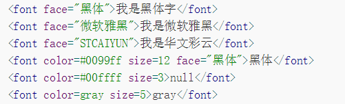

```JAVA
interface Face1{
	final double PI = 3.14;
	abstract double area();
}
```
>this is a blockquote with two	pargraphs.Lorem ipsum dolor sit amet,
consectetuer adipiscing elit. Aliquam hendrerit mi posuere lectus.
Vestibulum enim wisi, viverra nec, fringilla in, laoreet vitae, risus.


*   This is a list item with two paragraphs.
*		damsjnjsnjdhgcgvgsvvx
*		1986\. what a great season.

一、 分割线：
* 三个或更多-或 _ 或 * ，必须单独一行，可含空格
* * *
- - -
二、 链接语法:
* 文字链接：[名称]  (链接)
	1. 行内式：
 This is [an example](http://wowubuntu.com/markdown/#list/"Title") inline link.
	2. 参考式：
 This is [an example] [id] reference-style link.  
		* [id]:         http://wowubuntu.com/markdown/#list/"oppotion"
* 自动链接：<> 尖括号
		<http://baidu.com.cn>
* 图片链接：![图片名称]  (链接)
 * 
* 索引链接：

* [图片]  [1]

	[1]  :  链接


三、 强调：
	* 星号与下划线都可以，单是斜体，双是粗体，符号可跨行，符号可加空格
**一个人来到田纳西**
__毫无疑问__

*我做的馅饼
是全天下*

_最好吃的_

四、 标题：
* Setext方式

三个或更多	=== 或 ---

大标题
===
小标题
---
* Atx方式
# 一级标题
## 二级标题
### 三级标题
#### 四级标题
##### 五级标题
###### 六级标题

五、 无序列表：
* 	符号之后要加空格，+或-或*效果一样，但不能混合使用
	*	Red
	* black
	+ yellow
	- shite

六、 有序列表：
* 数字不能省略但可无序，点号之后的空格不能少
	1. Bird
	2. come
* 嵌套列表：-或+或*可循环使用，但符号之后的空格不能少，符号之前的空格也不能少

七、 代码：
* 行内代码：在第一行后指定编程语言，也可以不指定
* 代码段落：每行文字前加4个空格或者1个Tab

八、 表格：

		| Tables        | Are           | Cool  |
		| ------------- |:-------------:| -----:|
		| col 3 is      | right-aligned | $1600 |
		| col 2 is      | centered      |   $12 |
		| zebra stripes | are neat      |    $1 |

或者

		项目     | 价格
		-------- | ---
		Computer | $1600
		Phone    | $12
		Pipe     | $1

九、 字体、字号、颜色：



1. <font face = "黑体">我是黑体字</font>
2. <font face="微软雅黑">我是微软雅黑</font>
3. <font face="STCAIYUN">我是华文彩云</font>
4. <font color=#0099ff size=12 face="黑体">黑体</font>
5. <font color=#00ffff size=3>null</font>
6. <font color=gray size=5>gray</font>
